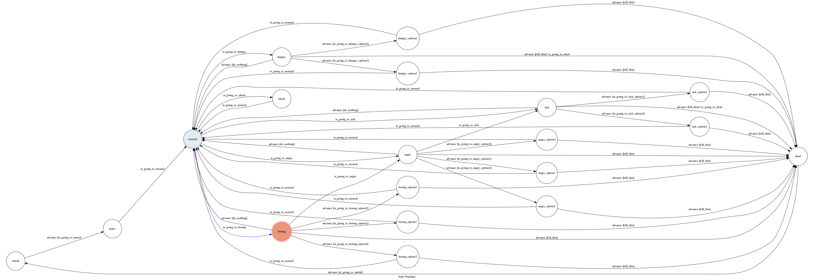

# chatbot_telegram

## My name is Joseph
實作出一個簡易的電子雞，bot會隨時間有不同狀態 -normal -hungry -sick -boring -angry -dead，各項數值達到一個標準時，會跳到相對應的狀態， 而在某些state 可以藉由選項來對bot 進行操作，目標是要讓bot 活的越久越好。

## State
+ Initial
+ name
+ check
+ normal

+ hungry
+ hungry option 1
+ hungry option 2

+ sick
+ sick option 1
+ sick option 2

+ boring
+ boring option 1
+ boring option 2
+ boring option 3

+ angry
+ angry option 1
+ angry option 2
+ angry option 3

+ dead

## 流程及內容
bot 有6種數值 

名稱|normal state|normal to next state|to next state|
---|---|---|---|
hungry level|+8/5s|70|life to 0 |
sick level|+3/5s|80|life to 0|
moode level|+4/5s|50|80|
boring level|+5/5s|20|50|

名稱|normal state|hungry|sick|boring|angry|
---|---|---|---|---|---|
life level|+10/5s|-10|-20|-2|-2|
money|+30/5s|no|no|no|no|

利用數值的變化決定要進入哪個state
1.  -hungry 和 -sick 會在 life=0 的時候讓bot 死亡
2.  -angry 到一定程度會 -sick
3.  -boring 到一定程度會 -angry
 
在-normal 的時候，如果沒有發生任何事情，則會 life +10

而money 則會在-normal 的時候 +30

而life 在進入不同state 的時候會+-

## 操作
執行python3 app.py

bot name : F74041022_bot

在進入bot /start之後

利用'intro' 開始

接下來bot 會自動開始活動

而只有當bot 需要玩家做操作時，才會跳出訊息通知玩家

玩家可以利用選項及顯示的資訊來操作，輸入option中括號裡的選項名稱來操作

也可以使用 'kill' 殺掉目前的bot 

在bot 死亡後，等待1分鐘來初始化

看到 "You can start again" 即可輸入 'initial' 來初始化

之後便可以再次利用 'intro' 開始

